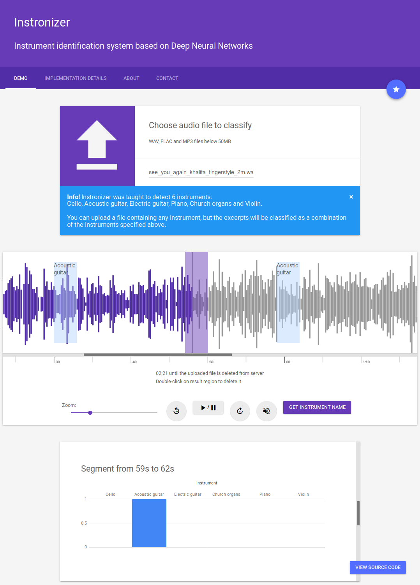

# Instronizer

## Description

**Instronizer** - instrument recognition system based on a usage of DNN (Deep Neural Networks)

At this point it was trained to identify 6 musical instruments:
- Cello
- Acoustic guitar
- Electric guitar
- Church organs
- Piano
- Violin

## Accuracy

It performs pretty well, achieving **86%** on our test dataset and **91%** on validation dataset.
At the beginning we were using **IRMAS** dataset but after some trainings and checking the labels, it turned out to be "not well made".
For this reason **we've built our own dataset from YouTube**.


This project was designed, written and is maintained by **Michał Martyniak**, **Maciej Rutkowski**, **Filip Schodowski**

**Demonstration video and more informations:**
[DEMO - michalmartyniak.me](http://michalmartyniak.me/recent_projects.html)

**If you have any questions, feel free to leave a pull request or contact me (micmarty) directly**



## System components

- Web application (Python, Flask, uWSGI, nginx, Travis CI, Docker, Google Material Design)

- Convolutional Neural Network (PyTorch framework, MobileNet architecture)

- Data preprocessor (Python) - WAV -> normalization -> downmixing -> downsampling -> mel-scaled spectrograms -> many .npy files

- IRMAS dataset:
    - 10 instruments + voice
    - very unbalanced
    - different labeling structure for train and test sets
    - very poor quality of annotations (wrong labels was a pain)
    - 20 - 39 min per instrument
    - Many excerpts from one song

- YouTube dataset: 
    - 6 instruments
    - Handmade by us
    - train (2h per instrument)
    - val (30 min per instrument)
    - test (30 min per instrument, about 1 min limit for every YouTube audio clip - diversified)

- Auxiliary scripts: YouTube downloader and parser


## Play with the code

You need to set **PYTHONPATH** environment variable first.
Code uses imports relative to ```<project_path>/src```
**In case of any problem, please contact us or leave a pull request**
```bash
cd <project_path>
# It's essential to import modules properly
export PYTHONPATH=<project_path>/src
```

## Requirements

We reccommend using **conda** to separate you system python packages from our project or to use prepared Dockerfile (webapp use only)

**Manual installation - preprocessing, training, validation, testing, webapp on trained network - TODO**
```bash

# 1. Install conda first 
# 2. Create new environment and activate it
conda create --name instronizer python=3.6 
source activate instronizer

# 3. Set project root/src
cd <project_path>
export PYTHONPATH=$(pwd)/src

# 4. Visit http://pytorch.org/ and install PyTorch for your platform
# Assuming Linux without CUDA here:
conda install pytorch torchvision -c pytorch

# 5. Install other dependencies
conda install -c conda-forge librosa
pip install better_exceptions tensorflow scipy soundfile Flask

# Example preprocessing
#
# dataset_dir can store e.g. train, val, test directories, each having directories for each class, containing WAV excerpts
# some_dir does not have to be an existing path
python src/preprocessor/wav_to_spectrograms.py --irmas --input <dataset_dir> --output-dir <some_dir>

# Example training
#
# dataset must contain:
# - train and val in this variation
# - val when --evaluate
# - test when --test
# You need to adjust batch size and validation batch size when the default values are too small or too big
# add --gpu when using CUDA
# Let's have a look at this script first or call it with --help ;)
python src/classifier/train.py <path_to_dataset> --print-freq 1 --num_classes 6

TODO
```
**Ready to test on trained model within the web application**
(fully working, ready to use)

```bash
# Example webapp launch
#
# Only docker is required to install, deployment is trivial
# Must be in project root
docker build . --tag instronizer
docker run -p 80:80 --name instronizer_container instronizer
# 
# Go to your browser, type: 
# localhost
# and enjoy testing :)
```
## Copyright

If you use our project in your research work/article/paper, please provide the link to this repo with authors' annotation.
Unfortunately, the documentation with method description is not available in English yet - contact micmarty.
